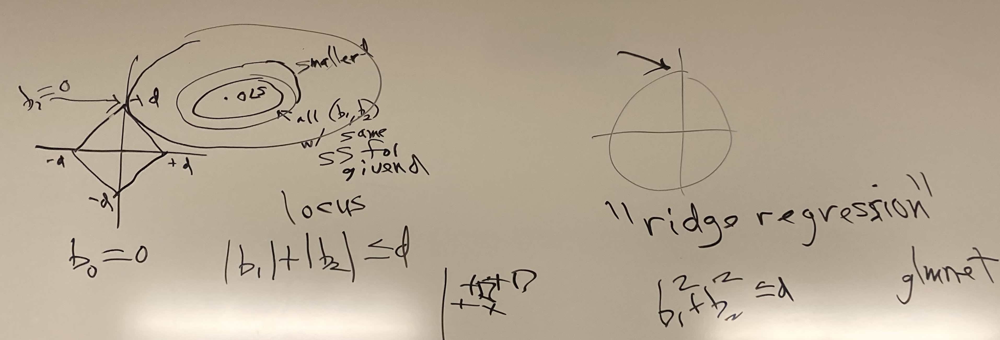

```{r setup, include=FALSE}
knitr::opts_chunk$set(echo = TRUE)
```

## [Polynomial Linear Models](https://github.com/matloff/qeML/blob/master/inst/mdFiles/ML_Overview.md#polynomial-linear-models)

> Some people tend to shrink when they become older. Thus we may wish to model a tendency for people to gain weight in middle age but then lose weight as seniors, a **nonlinear relation**.
>
> We could try a quadratic model:
>
> -   $m(height,age) = β_{0} + β_{1}\ height + β_{2}\ age + β_3\ age^{2}$
>
> -   Presumably β~3~ \< 0, since we want a negative quadratic representation (downward parabola might best represent weight over time)
>
> We may even include a height \* age product term, allowing for interactions. Polynomials of degree 3 and so on could also be considered.

We could add many feature transformations as additional features, such as:

-   height \* age

-   height\^2 \* age

-   height \* age\^2

-   etc...

As we increase the polynomial degree, the number of possible transformations and combinations of these increases exponentially

Adding too many transformed features leaves us **prone to overfitting**

> Forming the polynomial terms by hand would be tedious, especially since we would also have to do this for predicting new cases. Instead, we use **qePolyLin** (regression setting) and **qePolyLog** (classification). They make use of the package **polyreg**.

For a dummy variable (i.e. 1 - catcher, 0 - not catcher), transformations might not alter the value, for example:

-   If catcher == 0, catcher\^2 is also 0

-   If catcher == 1, catcher\^2 is also 1

-   **qePolyLin** will be smart enough to not create these unneccessary transformations from dummy variables

## [Shrinkage Methods](https://github.com/matloff/qeML/blob/master/inst/mdFiles/ML_Overview.md#shrinkage-methods-for-lineargeneralized-linear-models)

Say we're interested in mean(height) and mean(weight)

-   If we have 100 people, we would simply find the mean height and weight; these would create your estimate for your new vector

Say we're interested in mean(height), mean(weight), and mean(age)

-   If you have 3+ dimensions/variables, simply using mean height, weight, and age is no longer optimal

-   We instead may want to shrink the estimated b_i

    > Some deep mathematical theory implies that in linear models it may be advantageous to shrink the estimated b~i~. *Ridge* regression and the LASSO do this in a mathematically rigorous manner. Each of them minimizes the usual sum of squared prediction errors, subject to a limit being placed on the size of the b vector; for ridge, the size is defined as the sum of the b~i~^2^, while for the LASSO it's the sum of \|b~i~\|.

-   Shrinkage methods: James-Stein Theory

    > ([Source](https://www.mygreatlearning.com/blog/understanding-of-lasso-regression/#)) Shrinkage is where data values are shrunk towards a central point as the mean. The lasso procedure encourages simple, sparse models (i.e. models with fewer parameters).

qeLin minimizes the sum of squares:

-   $\sum_{min(b)}[Y_i = (\beta_0 + \beta_1X_1 + \beta_2X_2 + …)]^2$

We put constraints on it such that:

-   $|\beta_0| \leq d$

-   $|\beta_1| \leq d$

-   ...

-   $|\beta_p| \leq d$

d is chosen with error-based optimization, similar to choosing k for KNN

-   A very large d represents no constraint at all

-   A very small d will be overfitting

-   Find a "goldilocks" value of d through trial/error

### The LASSO

*"Least Absolute Shrinkage and Selection Operator"*



Example: Model represented by $\beta_0, \beta_1 X_1, \beta_2 X_2$ where $X_1$ is height, $X_2$ is age

-   Data centered so that $\beta_0 = 0$

-   The concentric ellipses represent values of $\beta_1$ and $\beta_2$ with equal Sum of Squares error for a given d

-   The diamond represents LASSO's d-constraint on the weights: $|\beta_1| + |\beta_2| \leq d$

    -   Going inside the diamond will increase error (bad)

    -   We want to expand the ellipse until we just barely hit a point on the error boundary (most likely one of the four corners of the diamond when using LASSO)

-   Why LASSO? The square-shape of the d-constraint makes it highly mathematically probable for the ellipse to reach the constraint boundary at one of the corners. The corners enable us to "eliminate" features with 0-weights.

    -   Top / Bottom corners: $\beta_1 = 0$ (i.e. we don't need to use height)

    -   Left / Right corners: $\beta_2 = 0$ (i.e. we don't need to use age)

    -   Useful for **dimension reduction**, to eliminate unnecessary features

    -   Use this as a preliminary step to decide which features to use/perform feature selection for subsequent models

### LASSO vs. Ridge Regression

LASSO (left) vs. Ridge (right) [Source](https://miro.medium.com/v2/resize:fit:1400/format:webp/1*Sxb7OPYTp5FAkQ72YrXrIA.png)

{alt="Lasso and Ridge regression: An intuitive comparison | by Thomas Le  Menestrel | Towards Data Science" width="386"}

-   LASSO Constraint uses **Absolute Value** Error

    -   $|\beta_1| + |\beta_2| \leq d$

-   Ridge Constraint uses **Sum Square** Error

    -   $\beta_1^2 + \beta_2^2 \leq d$

### qeLASSO Example

Predict "wageinc" variable

```{r}
library(qeML, quietly=T)
data(pef)
w <- qeLASSO(pef,'wageinc')
w$coefs
```

> There are six occupations, thus five indicator variables. The LASSO gave coefficients of 0 for occupations 106 and 140, so we might decide not to use them, even if we utimately use some other ML algorithm.

i.e. Above, occ.106 and occ.140 are eliminated by automatic feature selection/dimension reduction

```{r}
levels(pef$occ)
```

## [Support Vector Machines](https://github.com/matloff/qeML/blob/master/inst/mdFiles/ML_Overview.md#support-vector-machines)

Note: General consensus in the ML community:

-   Neural nets are good for non-tabular data (i.e. image data)

-   Use boosting (i.e. random forest, but where each tree improves on the last) on tabular data

Some people think Iris dataset is immoral? Use penguin dataset instead?

-   Sir Ronald Fisher developed a lot of statistics resources, such as iris dataset

-   As an upperclass British dude, he had repulsive racial attitudes that garner protest against use of his datasets (be careful if you give a presentation using this data)

### SVM on Iris Data

[{width="240"}](https://github.com/matloff/qeML/raw/master/inst/mdFiles/SVM.png)

> There are 3 classes, but we are just predicting setosa species (shown by + symbols) vs. non-setosa (shown by boxes) here. Below the solid line, we predict setosa, otherwise non-setosa.

**Optimizing Margin(s):**

> SVM philosophy is that we'd like a wide buffer separating the classes, called the *margin*, denoted by the dashed lines. Data points lying on the edge of the margin are termed *support vectors*, so called because if any other data point were to change, the margin would not change.
>
> In most cases, the two classes are not linearly separable. So we allow curved boundaries, implemented through polynomial (or similar) transformations to the data. The degree of the polynomial is a hyperparameter.

**Optimizing Cost:**

-   Small or Zero Cost: you can have any amount of points in the margin, but will not be very predictive

-   Large Cost: you cannot have many points in the margin, but will be difficult to fit & prone to error

> Another hyperparameter is **cost:** Here we allow some data points to be within the margin. The cost variable is roughly saying how many exceptions we are willing to accept.

## [Linear Algebra Basics](https://github.com/matloff/fastLinearAlgebra)

(Discussion 4/27/2023: Go through lessons 1:5)
