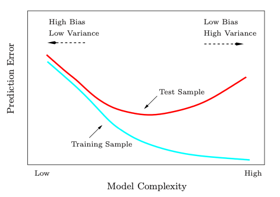

```{r setup, include=FALSE}
knitr::opts_chunk$set(echo = TRUE)
```

## [Overfitting](https://github.com/matloff/qeML/blob/master/inst/mdFiles/Overfitting.md)

(TODO: Reading)

**Overfitting Definitions**

-   Overfitted models predict poorly on new examples
-   "Fitting the noise"

**Bias-Variance Tradeoff**: we have a finite amount of data, which carries with it some sampling error; samples vary from each other (S.E.)

> Mean squared prediction error (MSPE) is the sum of squared bias and variance. Bias and variance are at odds with each other. The lower the bias, the more the variance. As we move through a sequence of models of increasing complexity, eventually the reduction in bias is overwhlemed by the increase in variance, a net loss. Somewhere in that sequence of models is a best one, i.e. one with minimum MSPE.

-   **Variance** refers to sampling error

-   **Bias** has two major types: leaving out variables, and things like edge bias

**Edge Bias**

**Variance Bias:** Estimators of σ^2^ - How do we estimate σ^2^ from the X~i~?

-   At first, one might take as our estimate S^2 =^ (1/n) Σ^n^~i=1~ (X~i~ - X~bar~)^2^ where X~bar~ is the sample mean (1/n) Σ^n^~i=1~ X~i~

-   But the pioneering statisticians didn't like this, because they found that E(S^2^) = ((n-1)/n) σ2

-   This underestimates S^2^ giving it a downward bias

-   Leads to addition of a correction factor: s^2^ = (n/(n-1)) S^2^

    -   Multiplication by n/(n-1) results in 0 bias, but larger variance (n/(n-1) \> 1)

Most estimators are biased; "can't treat bias as inherently evil"

**Model Bias**

Parametric Methods:

> Parametric methods such as linear and logistic models have a bias, in the sense of the fundamental inaccuracy of the model itself.
>
> Consider predicting the height of a person who is 68.2 inches tall. Our best prediction would be ρ(68.2), which we estimate from our data via r(68.2). Averaged over all possible samples, our prediction r(68.2) will NOT be equal to the true value, i.e. Ei[r(68.2)] ≠ ρ(68.2)

Nonparametric Methods:

> Bias arises as follows: Say we wish to predict weight for a person of height 64.2, which is on the shorter end of the height range. Then most of the neighboring people in our dataset are likely to be taller than 64.2, and since our prediction will consist of the mean weight among the neighbors, this 64.2-inch tall person's weight will likely be overestimated, i.e. E[r(64.2)] \> ρ(64.2)

Key Difference: In nonparametric methods, larger sample size (with a fixed k) will reduce bias

> With a very large sample, the neighbors of the 64.2-inch tall person, for example, will tend to be pretty close to 64.2, producing a smaller bias. This is in contrast to the example of the linear model, in which the bias persists even as the sample size grows.
>
> Note too that for fixed n, smaller k will result in smaller bias. Fewer neighbors means that the ones we have are close by

**Variance in Prediction**

Sampling Variance measures variance of estimated r(t) between different samples

### U-Shaped Curve

[URL](https://felperez.github.io/posts/2020/03/blog-post-31/)



Complexity (x) and MSE (y) typically has a U-Shape

-   Going right (increasing complexity), bias decreases as variance increases; Model gets more accurate/reduced error

-   Goldilocks point: "ideal" complexity at the minimum of the curve

-   At some point, additional complexity starts to increase error; variance overcomes bias

Application of Law of Diminishing Returns: benefit of adding more features eventually diminishes and is outweighed by the harm of having increased variance

### Million Song Dataset Example

Using a random subset of 10,000 songs and two audio variables, and fitting polynomial models in the two predictors, with increasing polynomial degree

Goal: show that

1.  As degree increases, MAPE at first falls but later rises, confirming the "U-shape" discussed above.
2.  But as degree increases, variance always increases.

After fitting degrees 1 through 12, variance [1,] and error [2,]:

-   Negative variance impossible (due to roundoff error) and indicates overfitting

-   Variance increases gradually over time until roundoff error

-   Algorithm trains by minimizing sum of squares; will likely not set coefficients to zero

-   Using LASSO helps prevent overfitting, since it will set some coefficients to zero

-   LASSO induces bias

-   MAPE: Mean Absolute Prediction Error used on holdout (test) data to see how it handles new data

-   Error decreases, and then increases, as in characteristic U-Shape

```         
           [,1]       [,2]       [,3]       [,4]       [,5]       [,6]
[1,] 0.02440784 0.02718803 0.03184419 0.04229401 0.04945168 0.05450264
[2,] 7.86296820 7.74149419 7.74222432 7.66320622 7.70638321 7.69907202
           [,7]       [,8]     [,9]        [,10]    [,11]    [,12]
[1,] 0.06572677 0.07980077 0.114887 -0.008906266       NA       NA
[2,] 7.73367546 7.70928618 7.733230  7.793813681 9.980302 17.36951
```

### Overfitting with High Accuracy

> In many ML applications, especially those in which neural networks are used, there may be far more hyperparameters than data points, i.e. p \>\> n. Yet excellent prediction accuracy on new data has often been reported in spite of such extreme overfitting.
>
> These phenomena occur in classification problems in which there is a very low error rate, 1 or 2% or even under 1%.
>
> In other words, the classes are widely separated, i.e. there is a large margin in the SVM sense. Thus a large amount of variance can be tolerated in the fitted model, and there is room for myriad high-complexity functions that separate the classes perfectly or nearly so, even for test data.
>
> Thus there are myriad fits that will achieve 0 training error, and the iterative solution method used by ML methods such as neural networks is often of a nature that the minimum norm solution is arrived at. In other words, of the ocean of possible 0-training error solutions, this one is smallest, which intuitively suggests that it is of small variance. This may produce very good test error.

### Double Descent

Instead of a U, we observe two or more "U-Shapes"

> The phenomenon of double descent is sometimes observed, in which the familiar graph of test set accuracy vs. model complexity consists of two U shapes rather than one. The most intriguing cases are those in which the first U ends at a point where the model fully interpolates the training data, i.e. 0 training error--and yet even further complexity actually reduces test set error.

## Bias Variance Tradeoff

### [Towards Data Science](https://towardsdatascience.com/understanding-the-bias-variance-tradeoff-165e6942b229)

> **What is bias?**
>
> Bias is the difference between the average prediction of our model and the correct value which we are trying to predict. **Model with high bias pays very little attention to the training data and oversimplifies the model.** It always leads to **high error on training and test data.**
>
> **What is variance?**
>
> Variance is the variability of model prediction for a given data point or a value which tells us spread of our data. **Model with high variance pays a lot of attention to training data** and does not generalize on the data which it hasn't seen before. As a result, **such models perform very well on training data but has high error rates on test data.**

### [Wikipedia](https://en.wikipedia.org/wiki/Bias%E2%80%93variance_tradeoff)

> -   The [*bias*](https://en.wikipedia.org/wiki/Bias_of_an_estimator "Bias of an estimator") error is an error from erroneous assumptions in the learning [algorithm](https://en.wikipedia.org/wiki/Algorithm "Algorithm"). High bias can cause an algorithm to miss the relevant relations between features and target outputs (underfitting).
>
> -   The [*variance*](https://en.wikipedia.org/wiki/Variance "Variance") is an error from sensitivity to small fluctuations in the training set. High variance may result from an algorithm modeling the random [noise](https://en.wikipedia.org/wiki/Noise_(signal_processing) "Noise (signal processing)") in the training data ([overfitting](https://en.wikipedia.org/wiki/Overfitting "Overfitting")).

**Summary:**

**High bias, low variance:**

-   Model is very basic and underfitted

-   High error in BOTH training and testing

-   High bias - training prediction error is large

-   Low variance - model is very insensitive to patterns/noise

**Low bias, high variance:**

-   Model is very complex and overfitted

-   Low training error but high testing error

-   Low bias - training prediction error is small

-   High variance - model predictions are very sensitive to noise
