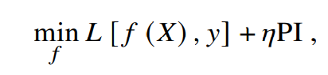

```{r setup, include=FALSE}
knitr::opts_chunk$set(echo = TRUE)
```

## [Fairness in Credit Scoring](https://arxiv.org/pdf/2103.01907.pdf)

------------------------------------------------------------------------

## 2.2.1 Independence

### **Independence Criterion**

> The score 𝑠(𝑋) satisfies independence at a cutoff 𝜏 if the fraction of customers classified as good risks (𝑦 = 1) is the same in each sensitive group. Formally, this condition can be written as:
>
> {width="312"}

-   False positive and false negatives might have significantly different penalties

    -   e.g. failing to flag potential fraud is much more costly than flagging non-fraud

    -   Adjust tau based on which we would like to prioritize

Kamishma et. al -\> good paper for project

------------------------------------------------------------------------

## 4.2.1 Pre-Processors

### Imbalanced Data

**Reweighting:** give higher weight to people who didn't show up

-   SMOTE: formal algorithm for reweighting

> Fairness pre-processors transform the input data to achieve fairness. Reweighing is a pre-processor that assigns weights to each observation in the training set based on the overall probabilities of the group-class combinations (Calders et al., 2009). Thus, weights for observations with (𝑥𝑎 = 1, 𝑦 = 1) are greater than weights for observations with (𝑥𝑎 = 0, 𝑦 = 1) if members of the group {𝑥𝑎 = 1} have a lower probability to belong to a positive class than those of the group {𝑥𝑎 = 0}:
>
> {width="307" height="61"}

$E(income | age, gender) = \beta_0 + \beta_1 age + \beta_2 1_M$

-   No matter ehat the age is, the effect of being male is the same

-   For any age, men are paid $\beta_2$ more than women

$E(income | age, gender) = \beta_0 + \beta_1 age + \beta_2 1_M + \beta_3 age*1_M$

-   Here, we drop that assumption

-   Interaction term: difference between men and women is age-dependent

-   $\beta_3$ measures the interaction between age and gender

**Stat consistent:** as the dataset grows, the estimated beta coefficients converge to the true population coefficient (consistent estimators)

-   Supposing the linear model we built is "true"

-   True even with unbalanced data

-   The convergence is "slower" if we have unbalanced data, but it will still converge

Matloff disagrees:

> This procedure [reweighting] helps to fulfill the independence criterion

------------------------------------------------------------------------

## 4.2.2 In-Processors

**Mutual Information**: loss function of choice

> The fairness-driven regularization introduced by Kamishima et al. (2012) is based on the prejudice index PI, which quantifies the degree of unfairness based on the independence criterion:
>
> {width="255" height="61"}
>
> where P(𝑦, 𝑥𝑎), P(𝑦) and P(𝑥𝑎) are empirical distributions of 𝑦 and 𝑥𝑎 over the sample 𝐷. PI measures the amount of mutual information between 𝑦 and 𝑥𝑎. High values of PI indicate that a sensitive attribute 𝑥𝑎 is a good predictor for y. The optimization problem extends to:
>
> {width="167" height="39"}

-   Akin to LASSO, except we are balancing fairness against utility; nothing to optimize

-   L for loss (i.e. misclassification error, squared prediction error, etc)

-   Regularization term: $\eta PI$

    -   Larger $\eta$ indicates greater fairness; smaller $\eta$ indicates greater optimization

    -   PI term prevents the first time from becoming overly optimized

    -   Over-optimization of model would result in unfair algorithm
